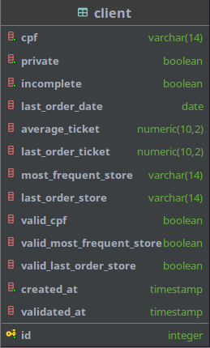

# neoway [](https://github.com/VictorAssunc/neoway/actions/workflows/go.yml)

Repositório contendo a solução para o teste técnico Neoway.

## Como Executar

É necessário clonar o repositório para executar o projeto:

**SSH:**
```shell
git clone git@github.com:VictorAssunc/neoway.git
```
**HTTPS:**
```shell
git clone https://github.com/VictorAssunc/neoway.git
```

Todos os seguintes comandos devem ser executados na raiz do projeto.

### Makefile

A execução do projeto é facilitada pelo `make`.

Para executar a aplicação com o banco de dados e acompanhar os logs da execução:
```shell
make run
```

Para interromper e limpar o banco de dados:
```shell
make stop
```

### Docker Compose

Para rodar o projeto apenas com `docker compose`:
```shell
docker compose -f deploy/docker-compose.yaml up -d --force-recreate --build
```

Para acessar os logs da execução:
```shell
docker compose -f deploy/docker-compose.yaml logs app -f
```

Para interromper e limpar o banco de dados:
```shell
docker compose -f deploy/docker-compose.yaml down -v
```

## Projeto

### Decisões técnicas

- A estrutura de arquivos é baseada em https://github.com/golang-standards/project-layout, que é um layout criado pela comunidade Golang.
- A arquitetura da solução é baseada em Clean Architecture.
- Os testes unitários foram desenvolvidos utilizando mocks, para abstrair conexões com o banco de dados.
- O postgres, sendo executado por docker compose, demora alguns segundos após a inicialização para ficar pronto para conexões. A falta de conexão no banco causa
interrupção não esperada da aplicação. Para contornar esse problema, foi utilizada uma estratégia de backoff retry constante com intervalo de 1 segundo entre as 
tentativas de conexão com o banco.
- Tanto a criação quanto a busca de clientes no banco é realizada em lotes, para evitar alto uso de memória.
- O Dockerfile segue a técnica de Multi Stage Build, cujo objetivo é otimizar o tamanho final da imagem gerada e reduzir a complexidade da imagem.

### Estrutura de Arquivos

```
.                   -> Raiz do projeto
├── assets          -> Arquivos estáticos para o repositório
├── build           -> Arquivos necessários para build da aplicação
├── cmd             -> Ponto de entrada da aplicação
├── deploy          -> Arquivos necessários para deploy/execução da aplicação
│   └── database    -> Arquivos de entrada necessários para estrutura do banco de dados
└── pkg             -> Pacotes desenvolvidos para a aplicação
    ├── entity      -> Estruturas que refletem o banco de dados
    ├── handler     -> Ponto de entrada para resolução dos problemas propostos
    ├── lib         -> Pacotes auxiliares para resolução de problemas específicos
    │   ├── cnpj    -> Pacote para validação de CNPJ
    │   ├── cpf     -> Pacote para validação de CPF
    │   ├── file    -> Pacote para abstração do File System
    │   ├── pointer -> Pacote para simplificação de uso de ponteiros
    │   └── regex   -> Pacote para constantes de Regex
    ├── repository  -> Camada de conexão entre aplicação e banco de dados
    │   ├── mock    -> Mock gerado para faciliar testes unitários a nível de `repository`
    │   └── query   -> Arquivos de query
    └── service     -> Camada de regra de negócios para resolução do problema proposto
        └── mock    -> Mock gerado para faciliar testes unitários a nível de `service`
```

### Banco de Dados


<details>
<summary>Migration</summary>

```sql
CREATE SCHEMA IF NOT EXISTS neoway;

CREATE TABLE IF NOT EXISTS neoway.client (
    id                        SERIAL      NOT NULL PRIMARY KEY,
    cpf                       VARCHAR(14) NOT NULL,
    private                   BOOLEAN     NOT NULL DEFAULT false,
    incomplete                BOOLEAN     NOT NULL DEFAULT false,
    last_order_date           DATE,
    average_ticket            DECIMAL(10,2),
    last_order_ticket         DECIMAL(10,2),
    most_frequent_store       VARCHAR(14),
    last_order_store          VARCHAR(14),
    valid_cpf                 BOOLEAN,
    valid_most_frequent_store BOOLEAN,
    valid_last_order_store    BOOLEAN,
    created_at                TIMESTAMP   NOT NULL DEFAULT CURRENT_TIMESTAMP,
    validated_at              TIMESTAMP
);
```

</details>

Os campos `valid_cpf`, `valid_most_frequent_store`, `valid_last_order_store` e `validated_at` foram criados para indicar a validação das informações de cada cliente.

## Requisitos

### Obrigatórios

- [X] Criar um serviço usando uma dessas linguagens: GO, Python, Javascript/Typescript (NodeJS)
- [X] Receber um arquivo csv/txt de entrada.
- [X] Persistir no banco de dados relacional (postgresql) todos os dados contidos no arquivo.
- [X] Fazer o split dos dados em colunas no banco de dados
- [X] Docker Compose, para toda estrutura, não sendo necessário instalar nada além do Docker para execução do projeto.
- [X] Adicionar orientações para executar no arquivo readme
- [X] Realizar higienização dos dados após persistência (sem acento, maiúsculas etc.)
- [X] Validar os CPFs/CNPJs contidos (válidos e não válidos numericamente)
- [X] Todo o código deve estar disponível em repositório público do GIT

### Desejáveis

- [X] Pode ser executado diretamente no serviço da linguagem desejada ou em sql
- [ ] Integração contínua na plataforma do repositório escolhido
- [X] Testes automatizados
- [X] Tempo de execução < 1 min
